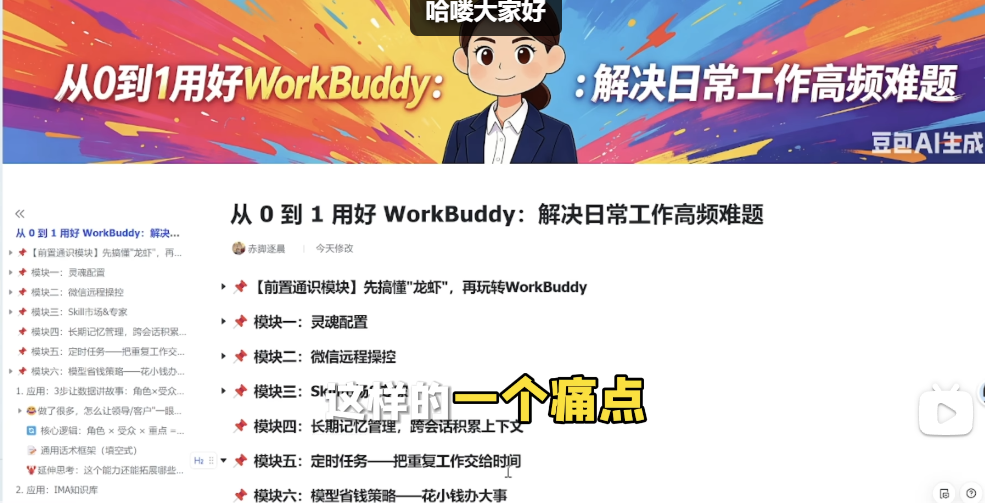
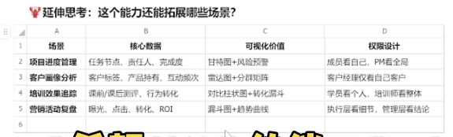

# 从 0 到 1 用好 【腾讯龙虾WorkBuddy】：解决日常工作高频难题
https://www.bilibili.com/video/BV1ffRjBEEM5?spm_id_from=333.788.videopod.sections&vd_source=68045788eb2af5a64a153edc696b3181


## 通用话术框架（填空式）
```
【角色+场景+困境+期望】
我是一名[你的角色]，正在准备[什么场景]的汇报/沟通。
手头有这些材料：[简单列举，如：学员考核表/客户跟进记录/项目进度表]
但我现在卡在这个问题：[具体困惑，如：过程努力但数据不亮眼/信息太多怕对方没耐心]
我希望最终呈现能达成：[核心目标，如：让领导看到培训价值/让客户信任我的专业]
请你：
1. 帮我分析：在这个场景下，受众最关心的3个核心问题是什么？
2. 基于我的材料，建议我应该重点突出哪3-5个信息点？为什么？
3. 如果用可视化呈现，推荐哪3种图表类型？分别回答什么业务问题？
4. 给我一句'开场金句'，30秒内让对方理解我想表达的核心价值。
```

