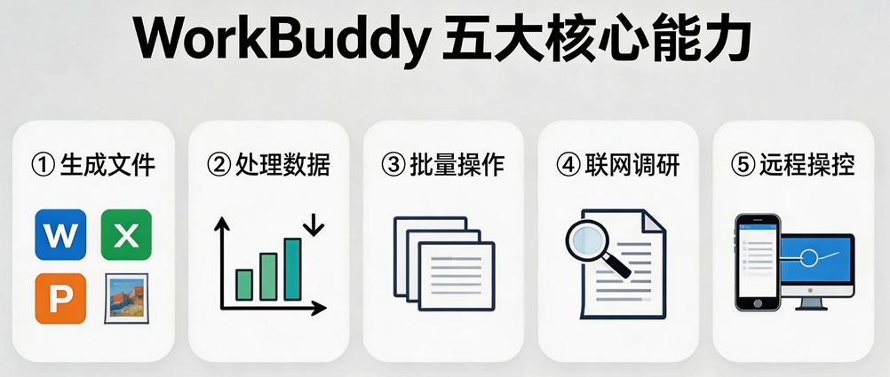
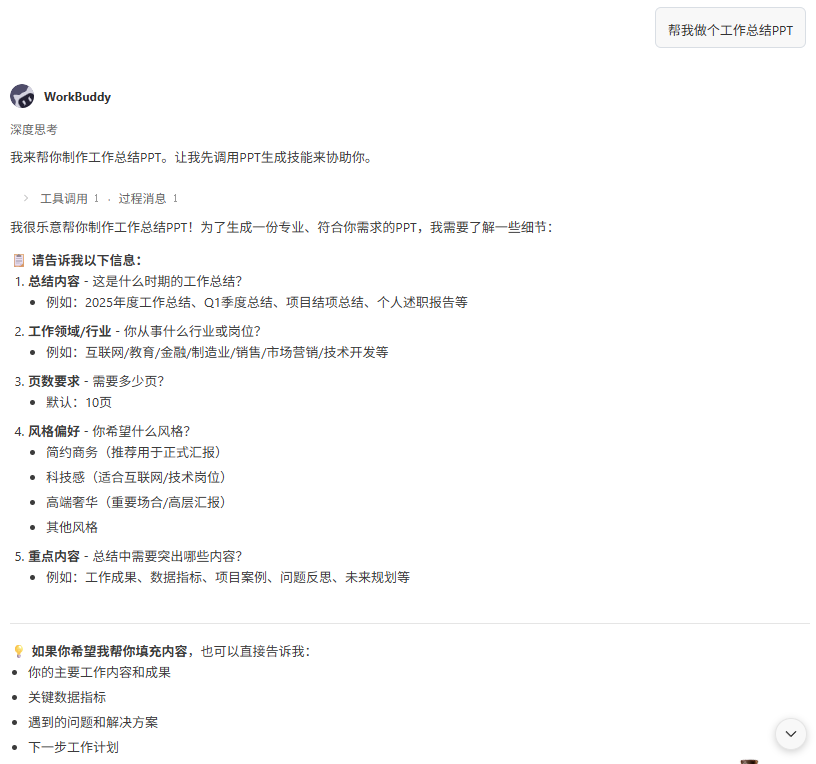

https://www.bilibili.com/video/BV11BoPBwEuf/?spm_id_from=333.337.search-card.all.click&vd_source=68045788eb2af5a64a153edc696b3181


```
帮我做一份月度销售搬告。数据是文档中的 xxx文件，按产品线汇总销售额，生成HTML展示柱状图，输出报告文件。
```


```
要求把文档中的销售明细Excel里的数据，按地区拆分成多个独立文件，每个地区一个Excel，文件名用地区命名，生成对应的文件夹，金部放到“按地区拆分”的文件夹里。
```







```
我是产品部的负责人，需要做一份本月工作总结PPT，下周一给部门领导汇报。内容包括：本月完成的3个重点顶目进展、遇到的2个主要问题和解决方案、下月工作计划和目标。先不要做，先帮我出一个方案：PPT分几页、每页放什么内容、用什么风格。
``` 