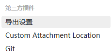

## 技术爬爬虾-Obsidian邪修用法，免费云同步，AI，手机端，进阶技巧
https://www.bilibili.com/video/BV1fZCyBYEuT/?spm_id_from=333.337.search-card.all.click&vd_source=68045788eb2af5a64a153edc696b3181

published:
created: 2026-05-04
description: "这两年我换了 N 个笔记工具，最终我还是选择了 Obsidian。 我有三个必须使用Obsidian理由，1.数据安全。2. 界面丝滑流畅 3. 跟AI工具绝配。, 视频播放量 159944、弹幕量 208、点赞数 5800、投硬币枚数 3662、收藏人数 12079、转发人数 1221, 视频作者 技术爬爬虾, 作者简介 分享好玩实用的软件DIY，全网同名，商务合作: zaihengderen ，相关视频：第一次用Obsidian？先把这8个插件装好再说，Obsidian+Claude+Skills+云同步，打造AI笔记，Obsidian胎教级新手教程，8分钟从零进阶！双向链接、云同步、必备设置，Obsidian+AI封神！小白手把手搭本地 AI 知识库，办公创作效率翻倍｜附文档，Obsidian 精通指南 - 学生终极知识管理工具｜Obsidian笔记 / 第二大脑 / 知识管理 / Markdown教程 / 高效学习 / 反向链接，Obsidian快速上手，25分钟学会它 你的知识不再遗忘，【中英+文稿】如何用Obsidian成为任何领域专家 | Obsidian全面使用指南，我是如何用obsidian+AI做知识管理&内容创作的？🤔，3年用户用心整理 从底层逻辑出发的Obsidian教程 | 用得越朴实，就越有价值，最适合普通人的本地AI知识库！彻底颠覆办公/创作工作流！【小白教程】"
tags:
  - "clippings"

安装了三个插件，具体如下：

